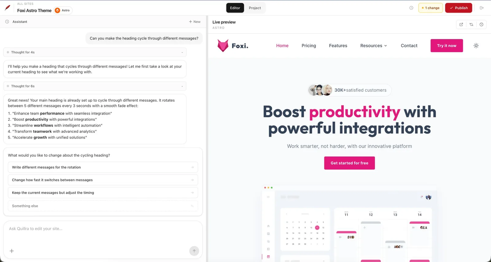
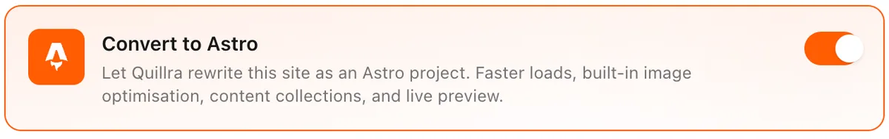

<p align="center">
  
</p>

<h1 align="center">From vibe-coded to client-ready.</h1>

<p align="center">
  <strong>Quillra is the modern, GitHub-native CMS for sites you actually wanted to build.</strong>
  <br />
  Hand the keys to your clients without bolting WordPress, Typo3, or a headless CMS subscription onto a clean codebase.
  <br />
  <em>Self-host for free, or use our paid SaaS.</em>
</p>

<p align="center">
  
</p>

<p align="center">
  <a href="#run-your-own-self-hosted"><strong>Self-host</strong></a> ·
  <a href="#how-it-works-in-practice"><strong>How it works</strong></a> ·
  <a href="#for-developers"><strong>For developers</strong></a>
</p>

---

## Why Quillra exists

You vibe-coded a beautiful site in Astro / Next / Vite / [whatever]. Now a real client needs to edit copy, swap photos, ship a new page — and you don't want to:

- 🚫 Rebuild the project on top of WordPress / Typo3 / Strapi / Sanity
- 🚫 Hand them a Git tutorial
- 🚫 Become their lifetime "please fix the headline" hotline
- 🚫 Pay per-seat for a multi-tenant CMS that owns your content

Quillra is the missing layer. Your repo stays the source of truth. Your client opens a chat, says *"change the homepage hero to 'Welcome to spring'"*, watches a live preview, hits **Publish**, and your existing CI deploys it. That's it.

> **Modern CMS for the post-WordPress generation.** Git is the database. Chat is the editor. Your hosting is unchanged.

## What it does

- 💬 **Chat-first editing** — clients describe changes in plain language, the agent edits the real files
- 👀 **Live preview** — every project gets its own dev server with hot reload, opened in an iframe right next to the chat. One-click "Ask the assistant to fix it" when the preview errors out.
- 🔁 **Real Git history** — every change is a real commit, attributed and reviewable, pushed to your existing repo
- 🚀 **Your existing pipeline** — Pages, Vercel, Netlify, Cloudflare, your VPS — Quillra never touches your hosting
- 🖼️ **Smart file handling** — paste, drag, or click to upload images or text/content files; saved to the right folder for your framework, optimised only when the framework doesn't already
- 🔒 **Role-aware permissions** — admin, editor, and client scopes baked into the agent's tool permissions
- 🧾 **Spend controls** — per-turn cost checkpoint visible in chat, organisation-wide usage dashboard with per-user drill-downs, optional warn/hard-cap thresholds (global, per-role, or per-user), and opt-in monthly usage reports per user for weiterverrechnung
- 🪄 **One-click migrate to Astro** — for vibe-coded React/Next/Gatsby sites that need a faster foundation, with design parity as a hard requirement

<p align="center">
  
</p>

- 🏷️ **Branded client portal** — each project can set its own logo for the client sign-in page; clients log in with an email code, not GitHub
- 📧 **Email built in** — Resend or any SMTP provider; invites, warnings, and reports all flow through a shared branded template that renders cleanly in Outlook and Gmail
- 🌍 **Full i18n** — English and German UI today, more on request; the agent answers in the user's chosen language
- 🏠 **Self-hosted by default** — one Docker container, your VPS, your data

## Frameworks we know

Auto-detected from `package.json` / config files. The agent is told which framework it's editing so it edits things the way that framework expects.

Astro · Next.js · Nuxt · Gatsby · SvelteKit · Remix · Eleventy · Vite · Hugo · Jekyll · plain HTML

Your dev server command is auto-detected, or you can override it per project.

## How it works (in practice)

1. Connect a **GitHub repository** and branch — Quillra clones it on your server
2. Invite people by email; they sign in with **GitHub** and only see projects they belong to
3. They **chat** with the assistant — it reads and edits files in the workspace under role-aware rules
4. **Publish** runs `git push` so your existing pipeline deploys, exactly as if a developer pushed

Dev previews are detected from `package.json`, or you can set a custom command per project.

---

## Run your own (self-hosted)

You deploy **one Quillra instance** (VPS, internal server, Docker). There are no org tiers — only **projects** (one repo each) and **per-project** members.

| Variable | Purpose |
|----------|---------|
| `BETTER_AUTH_URL` | Public URL of the API (OAuth callbacks and cookies) |
| `BETTER_AUTH_SECRET` | Session encryption secret (`openssl rand -base64 32`) |
| `TRUSTED_ORIGINS` | Browser origins allowed to call the API with cookies |
| `GITHUB_CLIENT_ID` / `GITHUB_CLIENT_SECRET` | GitHub OAuth for the owner's sign-in |
| `ANTHROPIC_API_KEY` | Powers the Claude Agent SDK on the server |
| `PREVIEW_DOMAIN` | Wildcard subdomain for per-project preview URLs |
| `EMAIL_PROVIDER` | `none` (default), `resend`, or `smtp` — powers invites, warnings, and monthly reports |

All other settings — GitHub App credentials (for cloning and pushing repos), Resend / SMTP keys, usage limits, alert email, `INSTANCE_*` Impressum fields — are configured at runtime from the Organization Settings page in the browser. The very first boot launches a setup wizard that walks the owner through them.

Copy `packages/api/.env.example` → `.env`, fill the values above, and start the container. The SQLite schema bootstraps itself on first run. Set the GitHub OAuth callback to `{BETTER_AUTH_URL}/api/auth/callback/github`.

**Server prerequisites:** Node.js, `git`, and a package manager on `PATH` so installs and dev previews work inside cloned workspaces.

The **Sites** dashboard lists every project you can access; from the editor, use the logo to return and connect more repositories. Organization Settings (owner only) covers email, API keys, team invites, usage, and spend controls.

### Don't want to self-host?

We're rolling out a managed SaaS — same product, we run the box. Check the website for the waitlist.

---

## For developers

```bash
yarn install
cp packages/api/.env.example packages/api/.env   # fill secrets
cd packages/api && DATABASE_URL=file:./data/cms.sqlite yarn db:push && cd ../..
yarn dev    # API :3000 + Vite :5173 (Turbo)
```

Production build (SPA is copied into `packages/api/public`):

```bash
yarn build
node packages/api/dist/index.js
```

Docker: see `Dockerfile` and `docker-compose.yml`; persist `packages/api/data` for SQLite and workspaces.

**Stack:** Hono, Better Auth, Drizzle + SQLite, Claude Agent SDK, sharp (API); React, Vite, React Router, TanStack Query, Tailwind (web). Yarn workspaces and Turborepo.

**UI:** Light, minimal chrome; accent `#C1121F` used sparingly.

Frontend layout: `packages/web/src/components/` — atoms, molecules, organisms, templates (`RequireAuth`).

---

## Status

**Ready for use.** Running in production on [cms.kanbon.at](https://cms.kanbon.at) and backing real agency work.

Shipped: GitHub OAuth + email-code login for team and clients · projects with per-project membership · multi-conversation chat with persistent history and cost-per-turn checkpoints · live preview with stage-aware boot screen and one-click "ask the assistant to fix it" on errors · framework-aware file upload (images + text/content) · GitHub App-based publish · role-aware tooling (admin / editor / client) · branded client login portal (per-project logo) · pluggable email (Resend or SMTP) with a shared Outlook-safe template · Astro migration with hard design parity · organisation-wide usage dashboard with per-user drill-down (12-month chart + tables) · spend controls (warn + hard cap, global / per-role / per-user, owner-exempt) · monthly usage report email per user (opt-in, daily cron + boot-time catch-up) · full English/German i18n.

## Contributing

Contributions are welcome — bug reports, feature proposals, PRs, docs, framework support.

Start with the **[contributing guide](./CONTRIBUTING.md)** — it covers local setup, code style, commit conventions, how to file a good bug report, and what the license means for contributors.

We follow a [Code of Conduct](./CODE_OF_CONDUCT.md) (Contributor Covenant v2.1).

### Contributors

<a href="https://github.com/kanbon/quillra/graphs/contributors">
  
</a>

<sub>Made with [contrib.rocks](https://contrib.rocks).</sub>

## License

Quillra is released under the **[Functional Source License v1.1, MIT Future License](./LICENSE)** (FSL-1.1-MIT).

In plain English:

- ✅ Free to **use commercially** — for your company, your clients, your agency, your side projects. Charge whatever you want for the work you do with it.
- ✅ Free to **fork, modify, and self-host** for your own use.
- ✅ After **two years**, every version automatically becomes full MIT — no restrictions at all.
- ❌ You may **not** use Quillra to build a **competing hosted/managed CMS service** (i.e. a "Quillra-as-a-service" competitor). That's the one thing we're protecting, because we run one ourselves.

If in doubt: self-hosting it for your own clients, your employer, or your own projects is always fine. Selling hosted Quillra to other people is not.
